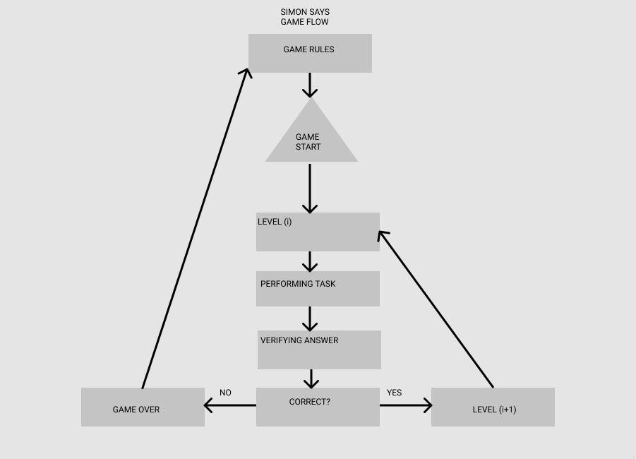
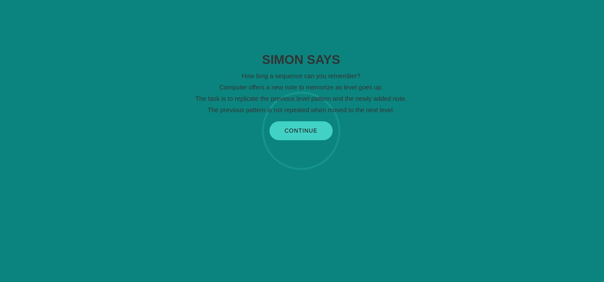
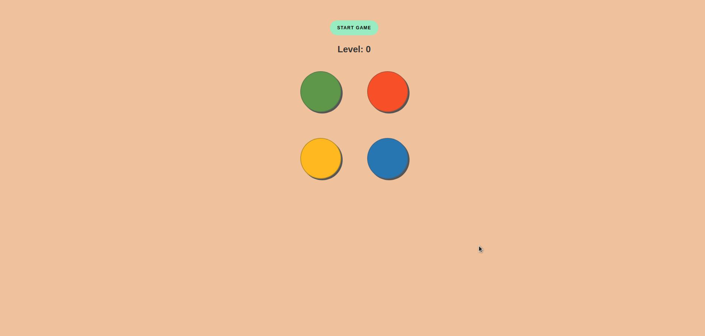
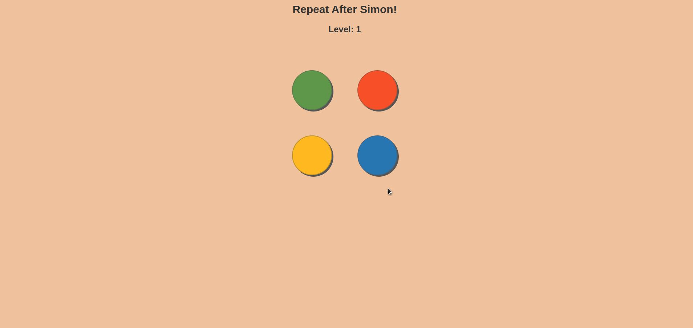
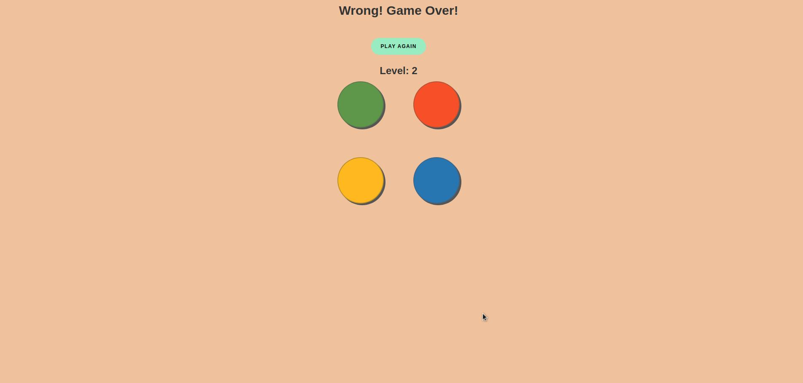
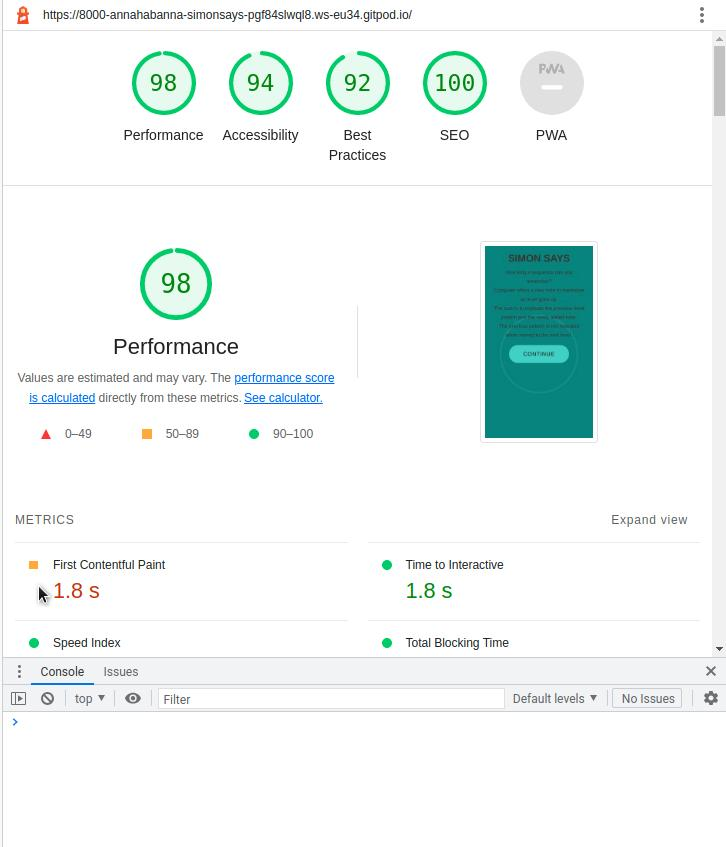
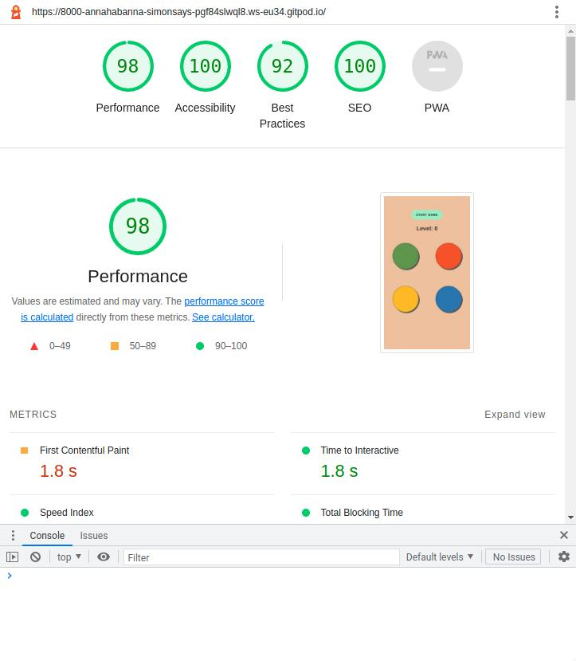
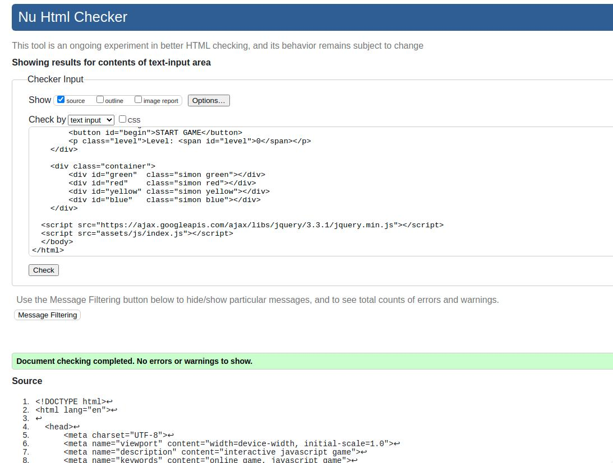
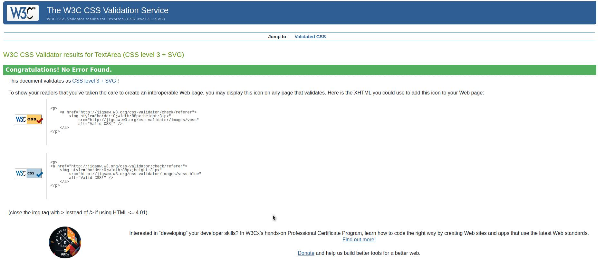
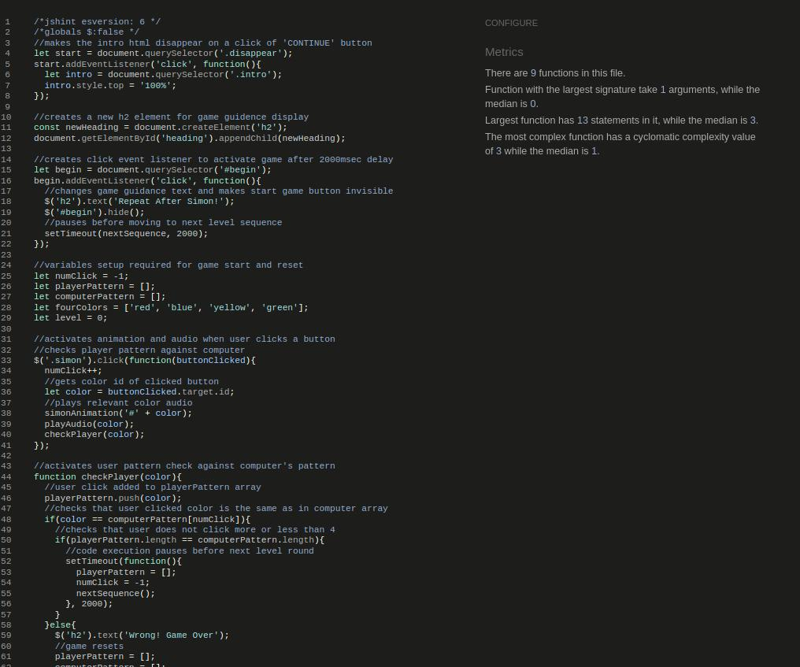

<br />
<div align="center">
  <h3 align="center">SIMON SAYS</h3>
  <p align="center">
    Interactive Javascript Game 
  <br />
    <a href="https://annahabanna.github.io/Simon-Says/">View Demo</a>
  <br />
  </p>
</div>

## About The Project

The project idea was inspired by childhood memory game Simon Says. Simon was released by Milton-Bradley in 1978 with much fanfare, including a midnight release party at Studio 54, the elite disco in New York City. An instance success, the game reached its peak during the 1980s and continued to sell for decades thereafter [learn more](http://web.pdx.edu/~kherb2/project2-simon-game/#:~:text=Simon%20was%20released%20by%20Milton,to%20sell%20for%20decades%20thereafter)

The aim of the game is to repeat a series of random computer clicks. After each round, the sequence becomes longer by one click which makes it harder to remember. 

Key project goal is to produce a simple memory game that can be used on all devices, stimulate memory and increase both auditory and visual attention.The target audience are users who consciously seek to improve attention, focus, concentration and musical hearing.

<details>
  <summary>Table of Contents</summary>
  <ol>
    <li><a href="#built-with">Built With</a></li>
    <li><a href="#ux-and-ui">UX and UI</a></li>
    <li><a href="#design">Design</a></li>
    <li><a href="#features">Features</a></li>
    <li><a href="#deployment">Deployment</a></li>
    <li><a href="#testing">Testing</a></li>
    <li><a href="#credits">Credits</a></li>
  </ol>
</details>


## Built With

The project was built using the following tools:

* [HTML](https://en.wikipedia.org/wiki/HTML)
* [CSS](https://en.wikipedia.org/wiki/CSS)
* [JavaScript](https://www.javascript.com/)
* [JQuery](https://jquery.com)

<p align="right">(<a href="#about-the-project">back to top</a>)</p>


## UX and UI

**User Story**
    
1. To play the game on any chosen device

2. To understand the rules of the game 

3. To be able to easily navigate the different parts of the game 

4  To be able to use all the interactive elements of the game

 **Game Flow**

The game flow schema was created using Figma. The game follows simple logic when user is required to navigate to the game start window and press the start game button. The game begins by computer activating a button with sound and animated press. The user then repeats what was 'played' by computer and the user input is then verified as being true or false. If the user input correctly replicates what computer 'played' a moment ago, the game then moves to the second level and computer activates another button. This time the user input has to include the previous input and the newly generated one. If the user makes a mistake the game is over and guidance is given to reset the game by returning to the window with game rules.



**Wireframe**

The wireframes for the game was creted using Figma where each page was drawn separately for both desktop and mobile view. Tablet version of the website was designed to repeat the destopview.

The directory containing the wireframe images can be found [here](assets/img/readme-img/game-wireframe.jpeg).

<p align="right">(<a href="#about-the-project">back to top</a>)</p>


## Design

**Colors**


The game colors were chosen to compliment the four colors of Simon Says game, ie. red, blue, green and yellow.  As my game design is small-scale and compact, the two distinctively different background colors were picked to make game navigation memorabe and  easily ditinguishable for the user. The main accent color of Celadon Green (#1E847F) was picked for game rules window with additional accent color of Medium Turquoise (#4FD1C5) for the continue button style. The picked font color Dark Charcoal (#333) is well accessible with great contrast ratio against the chosen background colors.
    
<details> 
<summary> ** Game rules window palette ** </summary>

</details>

The background color of the main game section is Peach Crayola (#ECC19C) which provides soft and subtle effect for the user eye. The four colors of Simon Says game act as accent colors and make it easier for user to focus while offering good accessibility rating against the chosen background color of Peach Crayola (#ECC19C). 

<details> 
<summary>** Color pallette continued **</summary>


  
</details>

**Fonts**

The font Goudy Bookletter Lora was chosen from available options from Google Fonts database. The Sans Serif font style was added as a browser-safe optional color.

<p align="right">(<a href="#about-the-project">back to top</a>)</p>


## Features

**Game Rules**

The game rules page is displayed first and contains instructions for user to read. The brief and clear explanaion offers a quick review of the game concept and its  goal. The button below is designed to call for action and navigate the user to the game section. 

The button template was borrowed at [www.codepen.io](https://codepen.io/mccombsc/pen/ZEzxWPy) and customized according to my project needs.

<details> 
<summary> ** Game rules** </summary>
 
</details>

**Game Section**

The game section visiually mimics the classic look of the game with four buttons colored in red, blue, yellow and green. The start button is placed on the top of the screen allowing the user to control the star of the game. Level indicator is set to 0 and located in the middle between the start button and the grid of four colored buttons.

<details> 
<summary> ** Game section ** </summary>

</details>

**Playing Game**

Game starts after the user clicks the start button which gets replaced by text message notifying the user to start repeating after Simon. The level indicator changes to level one. The turn is then passed to the user who has to repeat what Simon 'played' a moment ago. If the user clicks the required button, the game then moves to the next level. Starting from level two Simon continues to 'play' one button, however the user has to first produce level one button and then add the current level button. The game becomes more difficult with each level as more colors have to be memorized.

<details> 
<summary> ** Playing game ** </summary>

</details>

**Game Over**

The game is finished when user clicks the wrong color button. The user is then notified that game is over and reset button appears for user navigation back to the game rules  page.

<details> 
<summary> ** Game over ** </summary>

</details>

**Future Features**

I would like to improve usability by directing the user throughout a game cycle and provide extra quidance with text, ie. identifying when it is Simon's turn or user's, identifying how many clicks are left to complete.
I would like to implement a choice for level difficulty.

**Responsiveness**

Flexbox model was used to make the website responsive on all devices.

<p align="right">(<a href="#about-the-project">back to top</a>)</p>


## Deployment

This project was developed using GitPod, pushed to GitHub and deployed to GitHub Pages using the following steps:
1. Log in to GitHub and locate the website creator GitHub Repository ANNAhabANNA/Simon-Says
2. At the top on the right click Settings, scroll down to GitHub Pages and click to select
3. The website then gets built from the Main branch by default
4. The deployed website link [https://annahabanna.github.io/Simon-Says/](https://annahabanna.github.io/Simon-Says/) is then displayed on the top of page.

<p align="right">(<a href="#about-the-project">back to top</a>)</p>


## Testing

**Validator Testing**

The game was tested using the tools of World Wide Web Consortium (also known as W3C). The above mentioned tools are the Markup Validation Service and the CSS Validation Service. No errors were returned for submitted HTML and CSS code.
Continuous testing was run using Lighthouse within Google Chrome to verify performance and accessibility standards were met and to ensure best practices were followed.
Javascript code was tested by using JShint Validator and no error or warnings were detected.

<details> 
<summary> ** Lighthouse testing result ** </summary>



</details>


<details> 
<summary> ** HTML validator result ** </summary>


</details>

<details> 
<summary> ** CSS validator result ** </summary>


</details>

<details> 
<summary> ** JShint validator result ** </summary>


</details>

<p align="right">(<a href="#about-the-project">back to top</a>)</p>

**Manual Testing**

The game was tested manually across a range of devices to ensure all links and styling work correctly and to ensure responsiveness across a range of devices. All features on the page were tested to ensure functionality was not impacted. Testing was carried out on multiple browsers such as Google Chrome, Microsoft Edge, Mozilla Firefox, Safari and Opera. Testing was carried out on an Apple iPhone, Apple iPhone 13, Samsung Galaxy S20 FE, Samsung Galaxy A51, Apple iPad Pro & Windows 10 Desktops. 

* Game Rules
    1. When the continue button clicked it brings to the game section.
    2. The continue buttons is diplayed fully for screen sizes smaller than 500px.
    3. Tested on various browsers and mobiles.

 * Playing Game
    1. The start game button initiates the game.
    2. The buttons are activated by clicking and audio accompanies each click.
    3. The level indicator changes accordingly to the successfully achieved level.
    4. Tested on various browsers and mobiles.
    
  * Game Over
    1. The game stops after the wrong color click.
    2. The reset button appears and navigates to the game rules page. 
    3. The level indicator displays the final level achieved.
    4. The text message changes to notify that the game is over.
 
**Bugs**

* The audio files did not play after buttons were clicked. Console displayed unidentified audio path. My initial research focused on the javascript file path       rules, but the issue was related to the audio funciton not being passed to nextSequence function.
* Chrome devtools identified a favicon error and reserch resulted in inserting
  ``` <link rel="icon" href="data:;base64,iVBORw0KGgo="> ```
  This solved the issue in Chrome, but CSS validator produced favicon warning. This was solved by inserting 
  ```   <link rel="shortcut icon" href="assets/img/favicon"> ```
* HTML validator identified an error with aria-label for divs. This was solved by applying aria-labelledby instead.

<details> 
<summary> ** Bugs ** </summary>


</details>

## Credits

**Frameworks, Libraries and Tools**

* Am I Responsive - used to verify responsiveness of website on different devices.
* Figma - used to generate wireframe images.
* Chrome Dev Tools - used for overall development and tweaking, including testing responsiveness and performance.
* Font Awesome - used for social media and contact details icons in the footer and on the contact page.
* GitHub - used for version control and hosting.
* Google Fonts - used to import and alter website typography.
* Slack - used for support and advice from the Code Insitute Community.
* Coolors - used to create color palettes
* GitPod - used for automated dev environment
* W3C - Used for HTML & CSS Validation.
* Lighthouse - used for testing performance, accessibility and search engine optimization.
* Color Safe - used for testing color contrast for better accessibility.
* jQuery - used to for easier manipulation of HTML, event handling, animation.
 
**Audio**

* Audio effects for Simon Says buttons were downloaded at https://freesound.org/ from user Leszek Szary.

**Code/Content**

The following Youtube tutorials were used to assist my learning of game logic and coding solutions:

*[Recreating childhood: Simon Game](https://www.youtube.com/watch?v=ahGDFFAgKII)
*[Simon Game JavaScript Tutorial for Beginners](https://www.youtube.com/watch?v=n_ec3eowFLQ&t=2051s)
*[JavaScript Workshop: Simon Game](https://www.youtube.com/watch?v=FEL8gKaIm1Y)
*[Live Coding a Simon Game: HTML, CSS, Javascript](https://www.youtube.com/watch?v=W0MxUHlZo6U)

**Acknoweledgment**

 * My Mentor Chris Quinn.
 * Code Institute team and community.

<p align="right">(<a href="#about-the-project">back to top</a>)</p>

**Contact**

Your Name  - akozorkova@gmail.com

<p align="right">(<a href="#about-the-project">back to top</a>)</p>
